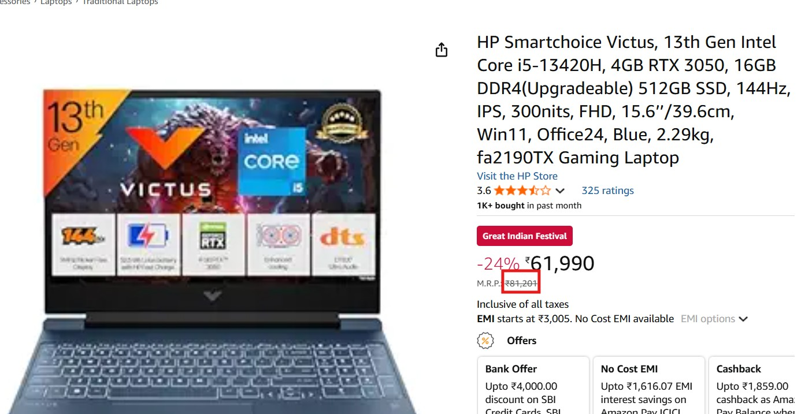

# 💻 Laptop Price Predictor

[](https://opensource.org/licenses/MIT)
[](https://www.python.org/downloads/)
[](https://flask.palletsprojects.com/)
[](https://scikit-learn.org/)

A comprehensive machine learning project that predicts laptop prices based on specifications using ensemble methods. Achieves **91.0% R² score**, **0.216 MAE**, and **0.292 RMSE** through advanced feature engineering and voting regression.

## 🎥 Demo Video

<p align="center">
  <a href="video/video.mp4">
    🎥 <b>Watch Demo</b>
  </a>
</p>

<p align="center">
  
  
</p>
## 🚀 Features

- **High-Performance Model**: 91.0% R² score with voting regressor ensemble
- **Complete Pipeline**: From data preprocessing to deployment
- **Enhanced Web Interface**: Interactive frontend with improved input fields
- **REST API**: Flask-based API for integration
- **Comprehensive Analysis**: Detailed EDA and feature engineering
- **Production Ready**: Modular codebase with proper error handling
- **Video Demonstration**: Includes demo video showing the complete workflow

## 📊 Model Performance

| Metric | Value |
|--------|-------|
| R² Score | 91.0% |
| MAE | 0.216 |
| RMSE | 0.292 |

## 🔧 Technology Stack

- **Machine Learning**: Scikit-learn, XGBoost, CatBoost, LightGBM
- **Data Analysis**: Pandas, NumPy, Matplotlib, Seaborn, Plotly
- **Backend**: Flask, Flask-CORS
- **Frontend**: HTML, CSS, JavaScript
- **Model Persistence**: Joblib, Pickle

## 📁 Project Structure

```
laptop-price-predictor/
├── 📊 data/                           # Dataset directory
├── 📓 notebooks/                      # Jupyter notebooks
│   └── laptop-price-predictor-91-0-216-mae-0-292-rmse.ipynb
├── 🧠 models/                         # Trained models
│   ├── laptop_price_voting_regressor1.pkl
│   └── fitted_fullpipeline1.pkl
├── 🔧 src/                           # Source code
│   ├── data/                         # Data processing modules
│   │   ├── data_loader.py           # Data loading utilities
│   │   └── transformers.py          # Feature transformers
│   ├── models/                       # Model training modules
│   │   └── model_training.py        # ML model implementations
│   ├── utils/                        # Utility functions
│   │   └── helpers.py               # Helper functions
│   └── visualization/                # Plotting utilities
│       └── plots.py                 # Visualization functions
├── 🌐 api/                           # Flask API
│   └── app.py                       # API endpoints
├── 🎨 frontend/                      # Web interface
│   ├── index.html                   # Main page with enhanced form
│   └── static/                      # CSS and JS files
│       ├── css/style.css
│       └── js/script.js
├── 🎥 video/                         # Demo video
│   └── video.mp4                    # Project demonstration video
├── 🚀 train.py                       # Model training script
├── 🔮 predict.py                     # Prediction script
├── 📋 requirements.txt               # Dependencies
└── 📜 README.md                      # This file
```

## 🔍 Dataset

The project uses the **Uncleaned Laptop Price Dataset** from Kaggle:
- **Source**: [Kaggle Dataset](https://www.kaggle.com/datasets/ehtishamsadiq/uncleaned-laptop-price-dataset)
- **Features**: Company, Type, RAM, Weight, Touchscreen, IPS, PPI, CPU, HDD, SSD, GPU, OS
- **Target**: Price (in various currencies)

## 🛠️ Installation

### Prerequisites
- Python 3.8+
- pip package manager

### Clone Repository
```bash
git clone https://github.com/SaadAbdElGhaffar/laptop-price-predictor.git
cd laptop-price-predictor
```
### Create a virtual environment
```bash
python -m venv venv
source venv/bin/activate  # On Windows: venv\Scripts\activate
```
### Install Dependencies
```bash
pip install -r requirements.txt
```

### Download Dataset
1. Download the dataset from [Kaggle](https://www.kaggle.com/datasets/ehtishamsadiq/uncleaned-laptop-price-dataset)
2. Place `laptopData.csv` in the `data/` directory

**💡 Tip**: Check out the [complete development process on Kaggle](https://www.kaggle.com/code/abdocan/laptop-price-predictor-91-0-216-mae-0-292-rmse/notebook) to see the step-by-step analysis and model building.

## 🚀 Quick Start

### 1. Train the Model
```bash
python train.py
```

### 2. Make Predictions
```bash
python predict.py
```

### 3. Run the API
```bash
cd api
python app.py
```
API will be available at `http://localhost:5000`


### 4. Launch Web Interface
Open `frontend/index.html` in your browser for the interactive interface.

### 5. Watch Demo Video
Check out the demonstration video in the `video/` folder to see the complete workflow and features in action.

## 🌐 Enhanced Web Interface

The web interface has been improved with:
- **Detailed Input Fields**: Screen size, resolution, RAM, storage (HDD/SSD), and weight as separate numeric inputs
- **User-Friendly Form**: Dropdown menus for categorical selections
- **Real-time Validation**: Input validation for better user experience
- **Responsive Design**: Works on desktop and mobile devices

### Input Fields:
- **Company**: Dropdown with major laptop manufacturers
- **Type**: Notebook, Gaming, Ultrabook, 2-in-1 Convertible, Workstation, Netbook
- **Screen Size**: Numeric input in inches (10-20)
- **Screen Resolution**: Dropdown with common resolutions (1366x768 to 4K)
- **CPU**: Intel Core i3/i5/i7, AMD, Other
- **RAM**: Numeric input in GB (2-64)
- **HDD**: Numeric input in GB (0-2000)
- **SSD**: Numeric input in GB (0-2000)
- **GPU**: Intel, Nvidia, AMD
- **Operating System**: Windows, macOS, Linux, No OS, Other
- **Weight**: Numeric input in kg (0.5-5.0)

## 📈 Usage Examples

### Python Script Prediction
```python
from predict import predict_laptop_price

# Define laptop specifications (enhanced input format)
laptop_specs = {
    'Company': 'Dell',
    'TypeName': 'Notebook',
    'Inches': '15.6',
    'ScreenResolution': '1920x1080',
    'Ram': '8',
    'Weight': '2.2',
    'Cpu': 'Intel Core i5',
    'HDD': '1000',
    'SSD': '256',
    'Gpu': 'Intel',
    'OpSys': 'Windows'
}

predicted_price = predict_laptop_price(laptop_specs)
print(f"Predicted Price: ₹{predicted_price:.2f}")
```

### API Request
```bash
curl -X POST http://localhost:5000/predict \
  -H "Content-Type: application/json" \
  -d '{
    "Company": "Dell",
    "TypeName": "Notebook",
    "Inches": "15.6",
    "ScreenResolution": "1920x1080",
    "Ram": "8",
    "Weight": "2.2",
    "Cpu": "Intel Core i5",
    "HDD": "1000",
    "SSD": "256",
    "Gpu": "Intel",
    "OpSys": "Windows"
  }'
```

## 🔬 Model Architecture

### Ensemble Approach
The final model uses a **Voting Regressor** combining:
- **Random Forest**: Robust baseline with feature importance
- **XGBoost**: Gradient boosting for complex patterns
- **CatBoost**: Excellent categorical feature handling
- **LightGBM**: Fast and efficient gradient boosting

### Feature Engineering
- **Categorical Encoding**: Label encoding and one-hot encoding
- **Numerical Scaling**: StandardScaler for continuous features
- **Feature Creation**: PPI calculation, storage combinations
- **Data Cleaning**: Missing value imputation, outlier handling

### Preprocessing Pipeline
```python
# Feature scaling based on normality tests
- Ram, Weight: StandardScaler (normal distribution)
- Ppi: No scaling (non-normal distribution)
- Categorical: Label/One-hot encoding
```

## 📊 Model Evaluation

### Cross-Validation Results
| Model | R² Score | MAE | RMSE |
|-------|----------|-----|------|
| Random Forest | 89.2% | 0.234 | 0.318 |
| XGBoost | 90.1% | 0.225 | 0.305 |
| CatBoost | 90.5% | 0.221 | 0.301 |
| LightGBM | 90.3% | 0.223 | 0.303 |
| **Voting Regressor** | **91.0%** | **0.216** | **0.292** |

### Feature Importance
Top features contributing to price prediction:
1. **RAM** - Memory capacity
2. **CPU Type** - Processor performance
3. **GPU** - Graphics capability
4. **SSD Storage** - Storage speed
5. **Screen Resolution (PPI)** - Display quality

## 🌐 API Documentation

### Endpoints

#### POST `/predict`
Predict laptop price based on specifications.

**Request Body:**
```json
{
  "Company": "string",
  "TypeName": "string", 
  "Inches": "string",
  "ScreenResolution": "string",
  "Ram": "string",
  "Weight": "string",
  "Cpu": "string",
  "HDD": "string",
  "SSD": "string", 
  "Gpu": "string",
  "OpSys": "string"
}
```

**Response:**
```json
{
  "price": 45000.50
}
```

## 🧪 Testing

Run the test suite:
```bash
python -m pytest tests/
```

## 📝 Data Preprocessing

The preprocessing pipeline includes:
1. **Data Cleaning**: Remove duplicates, handle missing values
2. **Feature Engineering**: Create PPI, extract numerical values
3. **Encoding**: Handle categorical variables appropriately
4. **Scaling**: Apply StandardScaler to normally distributed features
5. **Validation**: Ensure data quality and consistency


## 🤝 Contributing

1. Fork the repository
2. Create a feature branch (`git checkout -b feature/amazing-feature`)
3. Commit changes (`git commit -m 'Add amazing feature'`)
4. Push to branch (`git push origin feature/amazing-feature`)
5. Open a Pull Request

## 📚 Resources

- **Kaggle Notebook**: [Laptop Price Predictor Analysis](https://www.kaggle.com/code/abdocan/laptop-price-predictor-91-0-216-mae-0-292-rmse/notebook)
- **Dataset**: [Uncleaned Laptop Price Dataset](https://www.kaggle.com/datasets/ehtishamsadiq/uncleaned-laptop-price-dataset)
- **Documentation**: Check the `notebooks/` directory for detailed analysis

## 📄 License

This project is licensed under the MIT License - see the [LICENSE](LICENSE) file for details.

## 👨‍💻 Author

**Saad Abd El-Ghaffar**
- GitHub: [@SaadAbdElGhaffar](https://github.com/SaadAbdElGhaffar)
- Kaggle: [@abdocan](https://www.kaggle.com/abdocan)

## 🙏 Acknowledgments

- Dataset provided by [Ehtisham Sadiq](https://www.kaggle.com/ehtishamsadiq) on Kaggle
- Scikit-learn community for excellent ML tools
- Flask team for the lightweight web framework

---

⭐ **Star this repository if you found it helpful!**
